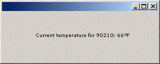



## GetTemperature Function \(Get temperature outside\)

### Description

This function will quickly and easily get the temperature of a zip code (returns a string). All you have to do is make a call with the zip code in it like so: GetTemperature(zip code here)!
 
### More Info
 

             |
---                |---
**Submitted On**   |2005-05-14 21:21:54
**By**             |[Jesse Seidel \(Dr\. Fire\)](https://github.com/Planet-Source-Code/PSCIndex/blob/master/ByAuthor/jesse-seidel-dr-fire.md)
**Level**          |Beginner
**User Rating**    |3.8 (19 globes from 5 users)
**Compatibility**  |VB 6\.0
**Category**       |[Internet/ HTML](https://github.com/Planet-Source-Code/PSCIndex/blob/master/ByCategory/internet-html__1-34.md)
**World**          |[Visual Basic](https://github.com/Planet-Source-Code/PSCIndex/blob/master/ByWorld/visual-basic.md)
**Archive File**   |[GetTempera1888335152005\.zip](https://github.com/Planet-Source-Code/jesse-seidel-dr-fire-gettemperature-function-get-temperature-outside__1-60532/archive/master.zip)

